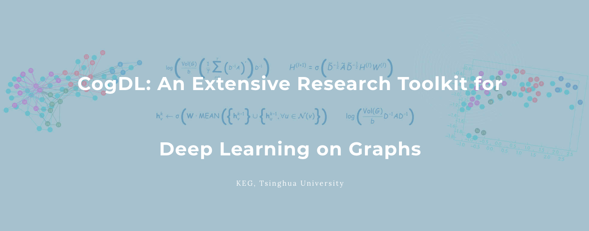

===

[](https://pypi.org/project/cogdl/)
[](https://travis-ci.org/THUDM/cogdl)
[](https://cogdl.readthedocs.io/en/latest/?badge=latest)
[](https://coveralls.io/github/THUDM/cogdl?branch=master)
[](https://github.com/THUDM/cogdl/blob/master/LICENSE)
[](https://github.com/ambv/black)

**[Homepage](http://keg.cs.tsinghua.edu.cn/cogdl)** | **[BAAI link](http://open.baai.ac.cn/cogdl-toolkit)** | **[Documentation](https://cogdl.readthedocs.io)** | **[Leaderboards](./cogdl/tasks/README.md)** | **[中文](./README_CN.md)**

CogDL is a graph representation learning toolkit that allows researchers and developers to easily train and compare baseline or custom models for node classification, link prediction and other tasks on graphs. It provides implementations of many popular models, including: non-GNN Baselines like Deepwalk, LINE, NetMF, GNN Baselines like GCN, GAT, GraphSAGE.

CogDL features:

- Task-Oriented: CogDL focuses on tasks on graphs and provides corresponding models, datasets, and leaderboards.
- Easy-Running: CogDL supports running multiple experiments simultaneously on multiple models and datasets under a specific task using multiple GPUs.
- Multiple Tasks: CogDL supports node classification and link prediction tasks on homogeneous/heterogeneous networks, as well as graph classification.
- Extensibility: You can easily add new datasets, models and tasks and conduct experiments for them!


## ❗ News

- The new **v0.2.0 release** includes easy-to-use `experiment` and `pipeline` APIs for all experiments and applications. The `experiment` API supports automl features of searching hyper-parameters. This release also provides `OAGBert` API for model inference (`OAGBert` is trained on large-scale academic corpus by our lab). Some features and models are added by the open source community (thanks to all the contributors 🎉).

- The new **v0.1.2 release** includes a pre-training task, many examples, OGB datasets, some knowledge graph embedding methods, and some graph neural network models. The coverage of CogDL is increased to 80%. Some new APIs, such as `Trainer` and `Sampler`, are developed and being tested. 

- The new **v0.1.1 release** includes the knowledge link prediction task, many state-of-the-art models, and `optuna` support. We also have a [Chinese WeChat post](https://mp.weixin.qq.com/s/IUh-ctQwtSXGvdTij5eDDg) about the CogDL release.

## Getting Started

### Requirements and Installation

- Python version >= 3.6
- PyTorch version >= 1.6.0
- PyTorch Geometric (recommended)
- Deep Graph Library (optional)

Please follow the instructions here to install PyTorch (https://github.com/pytorch/pytorch#installation), PyTorch Geometric (https://github.com/rusty1s/pytorch_geometric/#installation), and Deep Graph Library (https://docs.dgl.ai/install/index.html).

When PyTorch has been installed, cogdl can be installed using pip as follows:

```bash
pip install cogdl
```

Install from source via:

```bash
pip install git+https://github.com/thudm/cogdl.git
```

Or clone the repository and install with the following commands:

```bash
git clone git@github.com:THUDM/cogdl.git
cd cogdl
pip install -e .
```

## Usage

### API Usage

You can run all kinds of experiments through CogDL APIs, especially `experiment`. You can also use your own datasets and models for experiments. 
A quickstart example can be found in the [quick_start.py](https://github.com/THUDM/cogdl/tree/master/examples/quick_start.py). More examples are provided in the [examples/](https://github.com/THUDM/cogdl/tree/master/examples/).

```python
from cogdl import experiment

# basic usage
experiment(task="node_classification", dataset="cora", model="gcn")

# set other hyper-parameters
experiment(task="node_classification", dataset="cora", model="gcn", hidden_size=32, max_epoch=200)

# run over multiple models on different seeds
experiment(task="node_classification", dataset="cora", model=["gcn", "gat"], seed=[1, 2])

# automl usage
def func_search(trial):
    return {
        "lr": trial.suggest_categorical("lr", [1e-3, 5e-3, 1e-2]),
        "hidden_size": trial.suggest_categorical("hidden_size", [32, 64, 128]),
        "dropout": trial.suggest_uniform("dropout", 0.5, 0.8),
    }

experiment(task="node_classification", dataset="cora", model="gcn", seed=[1, 2], func_search=func_search)
```

Some interesting applications can be used through `pipeline` API. An example can be found in the [pipeline.py](https://github.com/THUDM/cogdl/tree/master/examples/pipeline.py). 

```python
from cogdl import pipeline

# print the statistics of datasets
stats = pipeline("dataset-stats")
stats(["cora", "citeseer"])

# visualize k-hop neighbors of seed in the dataset
visual = pipeline("dataset-visual")
visual("cora", seed=0, depth=3)

# load OAGBert model and perform inference
oagbert = pipeline("oagbert")
outputs = oagbert(["CogDL is developed by KEG, Tsinghua.", "OAGBert is developed by KEG, Tsinghua."])
```

### Command-Line Usage

You can also use `python scripts/train.py --task example_task --dataset example_dataset --model example_model` to run example_model on example_data and evaluate it via example_task.

- --task, downstream tasks to evaluate representation like `node_classification`, `unsupervised_node_classification`, `graph_classification`. More tasks can be found in the [cogdl/tasks](https://github.com/THUDM/cogdl/tree/master/cogdl/tasks).
- --dataset, dataset name to run, can be a list of datasets with space like `cora citeseer ppi`. Supported datasets include
'cora', 'citeseer', 'pumbed', 'ppi', 'wikipedia', 'blogcatalog', 'flickr'. More datasets can be found in the [cogdl/datasets](https://github.com/THUDM/cogdl/tree/master/cogdl/datasets).
- --model, model name to run, can be a list of models like `deepwalk line prone`. Supported models include
'gcn', 'gat', 'graphsage', 'deepwalk', 'node2vec', 'hope', 'grarep', 'netmf', 'netsmf', 'prone'. More models can be found in the [cogdl/models](https://github.com/THUDM/cogdl/tree/master/cogdl/models).

For example, if you want to run LINE, NetMF on Wikipedia with unsupervised node classification task, with 5 different seeds:

```bash
$ python scripts/train.py --task unsupervised_node_classification --dataset wikipedia --model line netmf --seed 0 1 2 3 4
```

Expected output:

| Variant                | Micro-F1 0.1   | Micro-F1 0.3   | Micro-F1 0.5   | Micro-F1 0.7   | Micro-F1 0.9   |
|------------------------|----------------|----------------|----------------|----------------|----------------|
| ('wikipedia', 'line')  | 0.4069±0.0011  | 0.4071±0.0010  | 0.4055±0.0013  | 0.4054±0.0020  | 0.4080±0.0042  |
| ('wikipedia', 'netmf') | 0.4551±0.0024  | 0.4932±0.0022  | 0.5046±0.0017  | 0.5084±0.0057  | 0.5125±0.0035  |

If you want to run parallel experiments on your server with multiple GPUs on multiple models, GCN and GAT, on the Cora dataset with node classification task:

```bash
$ python scripts/parallel_train.py --task node_classification --dataset cora --model gcn gat --device-id 0 1 --seed 0 1 2 3 4
```

Expected output:

| Variant         | Acc           |
| --------------- | ------------- |
| ('cora', 'gcn') | 0.8236±0.0033 |
| ('cora', 'gat') | 0.8262±0.0032 |

If you have ANY difficulties to get things working in the above steps, feel free to open an issue. You can expect a reply within 24 hours.

## Docker container

You might also opt to use a Docker container. There is an image available in this repo that you can build with the Torch and CUDA versions available in your system. To build the docker image just run:

```
docker build --build-arg CUDA=YOUR_CUDA_VERSION --build-arg TORCH=YOUR_TORCH_VERSION --tag cogdl .
```

Where `YOUR_CUDA_VERSION` should be cuxxx representing your cuda version (or just cpu) and `YOUR_TORCH_VERSION` should be the version of PyTorch you want to use. For example, to run with CUDA 10.1 and PyTorch 1.7.0 you can run:
```
docker build --build-arg CUDA=cu101 --build-arg TORCH=1.7.0 --tag cogdl .
```

Then you can start the container by running:
```
docker run -it -v cogdl:/cogdl cogdl /bin/bash
```

And then clone your fork or this repository into the cogdl folder:
```
git clone https://github.com/THUDM/cogdl /cogdl
```


## Contributing

### Add Your Own Dataset

If you have a unique and interesting dataset and are willing to publish it, you can submit your dataset via opening an issue in our repository, we will run all suitable methods on your dataset and update our leaderboard. 

### Implement Your Own Model

If you have a well-performed algorithm and are willing to implement it in our toolkit to help more people, you can create a pull request, detailed information can be found [here](https://help.github.com/en/articles/creating-a-pull-request). 

You can use the following command to create the necessary files for your model via our CLI.

```bash
$ python scripts/model_maker.py
```

Before committing your modification, please first run `pre-commit install` to setup the git hook for checking code format and style using `black` and `flake8`. Then the `pre-commit` will run automatically on `git commit`! Detailed information of `pre-commit` can be found [here](https://pre-commit.com/).

#### A brief guide to having a successful pull request (unit test)

To have a successful pull request, you need to have at least (1) your model script and (2) a unit test.

You might be confused why your pull request was rejected because of 'Coverage decreased ...' issue even though your model is working fine locally. This is because you have not included a unit test, which essentially runs through the extra lines of code you added. The Travis CI service used by Github conducts all unit tests on the code you committed and checks how many lines of the code have been checked by the unit tests, and if a significant portion of your code has not been checked (insufficient coverage), the pull request is rejected.

So how do you do a unit test? 

* Let's say you implement a GNN model in a script `models/nn/abcgnn.py` that does the task of node classification. Then, you need to add a unit test inside the script `tests/tasks/test_node_classification.py` (or whatever relevant task your model does). 
* To add the unit test, you simply add a function *test_abcgnn_cora()* (just follow the format of the other unit tests already in the script), fill it with required arguments and the last line in the function *'assert 0 <= ret["Acc"] <= 1'* is the very basic sanity check conducted by the unit test. 
* Then, in the main section, remember to call your test_abcgnn_cora() function. After modifying `tests/tasks/test_node_classification.py`, commit it together with your `models/nn/abcgnn.py` and your pull request should pass.

It is also a good idea to include an example script examples/gnn_models/abcgnn.py to show how your model can be run with appropriate arguments.
