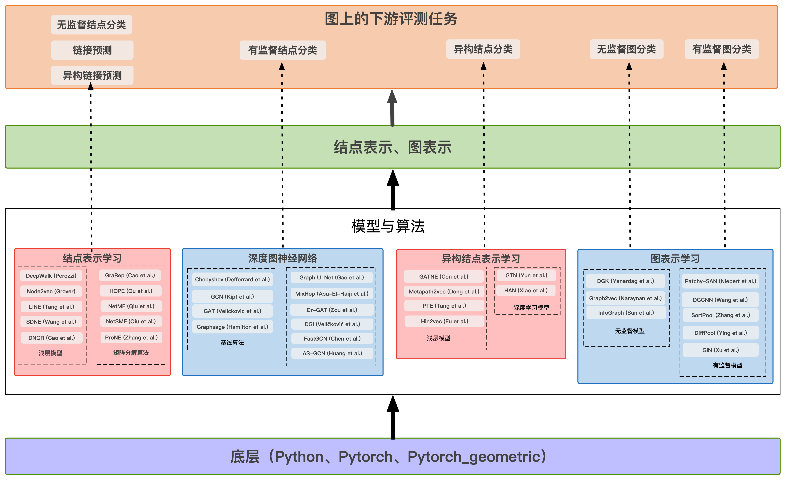

===

[](https://travis-ci.org/THUDM/cogdl)
[](https://coveralls.io/github/THUDM/cogdl?branch=master)
[](https://cogdl.readthedocs.io/en/latest/?badge=latest)
[](https://github.com/THUDM/cogdl/blob/master/LICENSE)
[](https://github.com/ambv/black)

**[主页](http://keg.cs.tsinghua.edu.cn/cogdl/cn)** | **[排行榜](./cogdl/tasks/README.md)** | **[文档](https://cogdl.readthedocs.io)** | **[智源链接](http://open.baai.ac.cn/cogdl-toolkit)** | **[数据集](./cogdl/datasets/README.md)** | **[English](./README.md)**

CogDL是由清华大学计算机系知识工程实验室（KEG）开发的基于图的深度学习的研究工具，基于Python语言和[PyTorch](https://github.com/pytorch/pytorch)库。CogDL允许研究人员和开发人员可以轻松地训练和比较基线算法或自定义模型，以进行结点分类，链接预测，图分类，社区发现等基于图结构的任务。 它提供了许多流行模型的实现，包括：非图神经网络算法例如Deepwalk、LINE、Node2vec、NetMF、ProNE、methpath2vec、PTE、graph2vec、DGK等；图神经网络算法例如GCN、GAT、GraphSAGE、FastGCN、GTN、HAN、GIN、DiffPool等。它也提供了一些下游任务，包括结点分类（分为是否具有节点属性），链接预测（分为同构和异构），图分类（分有监督和⽆监督）以及为这些任务构建各种算法效果的排行榜。

CogDL的特性包括：

- 任务导向： CogDL以图上的任务为主，提供了相关的模型、数据集以及我们得到的排行榜。
- 一键运行： CogDL支持用户使用多个GPU同时运行同一个任务下多个模型在多个数据集上的多组实验。
- 多类任务： CogDL支持同构/异构网络中的节点分类和链接预测任务以及图分类任务。
- 可扩展性：用户可以基于CogDL已有的框架来实现和提交新的数据集、模型和任务。

## ❗ 最新

- 最新的 **v0.2.0版本** 包含了非常易用的`experiment`和`pipeline`接口，其中`experiment`接口还支持超参搜索。这个版本还提供了`OAGBert`模型的接口（`OAGBert`是我们实验室推出的在大规模学术语料下训练的模型）。这个版本的很多内容是由开源社区的小伙伴们提供的，感谢大家的支持！🎉

- 最新的 **v0.1.2版本** 包括了预训练任务、各种使用样例、OGB数据集、知识图谱表示学习算法和一些图神经网络模型。CogDL的测试覆盖率增加至80%。正在开发和测试一些新的API，比如`Trainer`和`Sampler`。

- 最新的 **v0.1.1版本** 包括了知识图谱链接预测任务、很多前沿的模型，支持使用`optuna`进行超参搜索。我们同时发布了一篇[推送](https://mp.weixin.qq.com/s/IUh-ctQwtSXGvdTij5eDDg)来介绍CogDL。

## 安装说明

### 系统配置要求

- Python 版本 >= 3.6
- PyTorch 版本 >= 1.6.0
- PyTorch Geometric (建议安装)
- Deep Graph Library (可选安装)

请根据如下链接来安装PyTorch (https://github.com/pytorch/pytorch#installation)，PyTorch Geometric (https://github.com/rusty1s/pytorch_geometric/#installation)，和Deep Graph Libraray (https://docs.dgl.ai/install/index.html)。

PyTorch安装好之后，cogdl能够直接通过pip来安装：
```bash
pip install cogdl
```

通过如下指令来从github源来安装：

```bash
pip install git+https://github.com/thudm/cogdl.git
```

或者先将CogDL下载下来然后通过以下指令安装：

```bash
git clone git@github.com:THUDM/cogdl.git
cd cogdl
pip install -e .
```

## 使用说明

### API

您可以通过CogDL API进行各种实验，尤其是`experiment`。[quick_start.py](https://github.com/THUDM/cogdl/tree/master/examples/quick_start.py)这是一个快速入门的代码。您也可以使用自己的数据集和模型进行实验。[examples/](https://github.com/THUDM/cogdl/tree/master/examples/) 文件夹里提供了一些例子。

```python
from cogdl import experiment

# basic usage
experiment(task="node_classification", dataset="cora", model="gcn")

# set other hyper-parameters
experiment(task="node_classification", dataset="cora", model="gcn", hidden_size=32, max_epoch=200)

# run over multiple models on different seeds
experiment(task="node_classification", dataset="cora", model=["gcn", "gat"], seed=[1, 2])

# automl usage
def func_search(trial):
    return {
        "lr": trial.suggest_categorical("lr", [1e-3, 5e-3, 1e-2]),
        "hidden_size": trial.suggest_categorical("hidden_size", [32, 64, 128]),
        "dropout": trial.suggest_uniform("dropout", 0.5, 0.8),
    }

experiment(task="node_classification", dataset="cora", model="gcn", seed=[1, 2], func_search=func_search)
```

您也可以通过`pipeline`接口来跑一些有趣的应用。下面这个例子能够在[pipeline.py](https://github.com/THUDM/cogdl/tree/master/examples/pipeline.py)文件中找到。

```python
from cogdl import pipeline

# print the statistics of datasets
stats = pipeline("dataset-stats")
stats(["cora", "citeseer"])

# visualize k-hop neighbors of seed in the dataset
visual = pipeline("dataset-visual")
visual("cora", seed=0, depth=3)

# load OAGBert model and perform inference
oagbert = pipeline("oagbert")
outputs = oagbert(["CogDL is developed by KEG, Tsinghua.", "OAGBert is developed by KEG, Tsinghua."])
```


### 命令行
基本用法可以使用 `python train.py --task example_task --dataset example_dataset --model example_model` 来在 `example_data` 上运行 `example_model` 并使用 `example_task` 来评测结果。

- --task, 运行的任务名称，像`node_classification`, `unsupervised_node_classification`, `graph_classification`这样来评测模型性能的下游任务。
- --dataset, 运行的数据集名称，可以是以空格分隔开的数据集名称的列表,现在支持的数据集包括 cora, citeseer, pumbed, ppi, wikipedia, blogcatalog, dblp, flickr等。
- --model, 运行的模型名称,可以是个列表，支持的模型包括 gcn, gat, deepwalk, node2vec, hope, grarep, netmf, netsmf, prone等。

如果你想在 Wikipedia 数据集上运行 LINE 和 NetMF 模型并且设置5个不同的随机种子，你可以使用如下的命令

```bash
$ python scripts/train.py --task unsupervised_node_classification --dataset wikipedia --model line netmf --seed 0 1 2 3 4
```

预计得到的结果如下：

| Variant                | Micro-F1 0.1   | Micro-F1 0.3   | Micro-F1 0.5   | Micro-F1 0.7   | Micro-F1 0.9   |
|------------------------|----------------|----------------|----------------|----------------|----------------|
| ('wikipedia', 'line')  | 0.4069±0.0011  | 0.4071±0.0010  | 0.4055±0.0013  | 0.4054±0.0020  | 0.4080±0.0042  |
| ('wikipedia', 'netmf') | 0.4551±0.0024  | 0.4932±0.0022  | 0.5046±0.0017  | 0.5084±0.0057  | 0.5125±0.0035  |

如果你想使用多个 GPU 同时在 Cora 数据集上运行 GCN 和 GAT 模型，可以使用如下指令:

```bash
$ python scripts/parallel_train.py --task node_classification --dataset cora --model gcn gat --device-id 0 1 --seed 0 1 2 3 4
```

预计得到的结果如下:

| Variant         | Acc           |
| --------------- | ------------- |
| ('cora', 'gcn') | 0.8236±0.0033 |
| ('cora', 'gat') | 0.8262±0.0032 |


## Docker

您也可以选择使用Docker来配置cogdl所需的环境。要构建Docker镜像，只需运行以下命令。

```bash
docker build --build-arg CUDA=YOUR_CUDA_VERSION --build-arg TORCH=YOUR_TORCH_VERSION --tag cogdl .
```
请根据您的CUDA版本（或CPU）更换 `YOUR_CUDA_VERSION` 以及 更换 `YOUR_TORCH_VERSION` 为您使用的PyTorch版本。


例如，使用 CUDA 10.1 和 PyTorch 1.7.0 一起运行

```bash
docker build --build-arg CUDA=cu101 --build-arg TORCH=1.7.0 --tag cogdl .
```

启动容器

```bash
docker run -it -v cogdl:/cogdl cogdl /bin/bash
```

将cogdl克隆到cogdl目录下：

```bash
git clone https://github.com/THUDM/cogdl /cogdl
```

## CogDL的整体框架




CogDL的整体框架如上图所示，针对不同的任务，CogDL支持以下模型：

*   无监督结点分类: ProNE [(Zhang et al, IJCAI'19)](https://www.ijcai.org/Proceedings/2019/0594.pdf), NetMF [(Qiu et al, WSDM'18)](http://arxiv.org/abs/1710.02971), Node2vec [(Grover et al, KDD'16)](http://dl.acm.org/citation.cfm?doid=2939672.2939754), NetSMF [(Qiu et at, WWW'19)](https://arxiv.org/abs/1906.11156), DeepWalk [(Perozzi et al, KDD'14)](http://arxiv.org/abs/1403.6652), LINE [(Tang et al, WWW'15)](http://arxiv.org/abs/1503.03578), Hope [(Ou et al, KDD'16)](http://dl.acm.org/citation.cfm?doid=2939672.2939751), SDNE [(Wang et al, KDD'16)](https://www.kdd.org/kdd2016/papers/files/rfp0191-wangAemb.pdf), GraRep [(Cao et al, CIKM'15)](http://dl.acm.org/citation.cfm?doid=2806416.2806512), DNGR [(Cao et al, AAAI'16)](https://www.aaai.org/ocs/index.php/AAAI/AAAI16/paper/download/12423/11715).  
    
*   半监督结点分类: SGC-PN [(Zhao & Akoglu, 2019)](https://arxiv.org/abs/1909.12223), Graph U-Net [(Gao et al., 2019)](https://arxiv.org/abs/1905.05178), MixHop [(Abu-El-Haija et al., ICML'19)](https://arxiv.org/abs/1905.00067), DR-GAT [(Zou et al., 2019)](https://arxiv.org/abs/1907.02237), GAT [(Veličković et al., ICLR'18)](https://arxiv.org/abs/1710.10903), DGI [(Veličković et al., ICLR'19)](https://arxiv.org/abs/1809.10341), GCN [(Kipf et al., ICLR'17)](https://arxiv.org/abs/1609.02907), GraphSAGE [(Hamilton et al., NeurIPS'17)](https://arxiv.org/abs/1706.02216), Chebyshev [(Defferrard et al., NeurIPS'16)](https://arxiv.org/abs/1606.09375).  
    
*   异构结点分类: GTN [(Yun et al, NeurIPS'19)](https://arxiv.org/abs/1911.06455), HAN [(Xiao et al, WWW'19)](https://arxiv.org/abs/1903.07293), PTE [(Tang et al, KDD'15)](https://arxiv.org/abs/1508.00200), Metapath2vec [(Dong et al, KDD'17)](https://ericdongyx.github.io/papers/KDD17-dong-chawla-swami-metapath2vec.pdf), Hin2vec [(Fu et al, CIKM'17)](https://dl.acm.org/doi/10.1145/3132847.3132953).  
    
*   链接预测: ProNE [(Zhang et al, IJCAI'19)](https://www.ijcai.org/Proceedings/2019/0594.pdf), NetMF [(Qiu et al, WSDM'18)](http://arxiv.org/abs/1710.02971), Node2vec [(Grover et al, KDD'16)](http://dl.acm.org/citation.cfm?doid=2939672.2939754), DeepWalk [(Perozzi et al, KDD'14)](http://arxiv.org/abs/1403.6652), LINE [(Tang et al, WWW'15)](http://arxiv.org/abs/1503.03578), Hope [(Ou et al, KDD'16)](http://dl.acm.org/citation.cfm?doid=2939672.2939751), NetSMF [(Qiu et at, WWW'19)](https://arxiv.org/abs/1906.11156), SDNE [(Wang et al, KDD'16)](https://www.kdd.org/kdd2016/papers/files/rfp0191-wangAemb.pdf).  
    
*   多重边链接预测: GATNE [(Cen et al, KDD'19)](https://arxiv.org/abs/1905.01669), NetMF [(Qiu et al, WSDM'18)](http://arxiv.org/abs/1710.02971), ProNE [(Zhang et al, IJCAI'19)](https://www.ijcai.org/Proceedings/2019/0594.pdf), Node2vec [(Grover et al, KDD'16)](http://dl.acm.org/citation.cfm?doid=2939672.2939754), DeepWalk [(Perozzi et al, KDD'14)](http://arxiv.org/abs/1403.6652), LINE [(Tang et al, WWW'15)](http://arxiv.org/abs/1503.03578), Hope [(Ou et al, KDD'16)](http://dl.acm.org/citation.cfm?doid=2939672.2939751), GraRep [(Cao et al, CIKM'15)](http://dl.acm.org/citation.cfm?doid=2806416.2806512).  
    
*   无监督图分类: Infograph [(Sun et al, ICLR'20)](https://openreview.net/forum?id=r1lfF2NYvH), Graph2Vec [(Narayanan et al, CoRR'17)](https://arxiv.org/abs/1707.05005), DGK [(Yanardag et al, KDD'15)](https://dl.acm.org/doi/10.1145/2783258.2783417).  
    
*   有监督图分类: GIN [(Xu et al, ICLR'19)](https://openreview.net/forum?id=ryGs6iA5Km), DiffPool [(Ying et al, NeuIPS'18)](https://arxiv.org/abs/1806.08804), SortPool [(Zhang et al, AAAI'18)](https://www.cse.wustl.edu/~muhan/papers/AAAI_2018_DGCNN.pdf), PATCH\_SAN [(Niepert et al, ICML'16)](https://arxiv.org/pdf/1605.05273.pdf), DGCNN [(Wang et al, ACM Transactions on Graphics'17)](https://arxiv.org/abs/1801.07829).


## 自定义数据集或模型

- 提交你的先进算法：如果您有一个性能优异的算法并愿意发布出来，你可以在我们的代码仓库里提出一个[issue](https://github.com/qibinc/cognitive_graph/issues)。在验证该算法的原创性，创造性和效果后，我们将该算法的效果添加到我们的排行榜上。
- 添加你自己的数据集：如果您有一个独特，有研究价值的数据集并且愿意发布出来，你可以在我们的代码仓库里提出一个[issue](https://github.com/qibinc/cognitive_graph/issues)，我们将把所以适合的模型在您的数据集上运行并更新我们的排行榜。
- 实现你自己的模型：如果您有一个性能优秀的算法，并愿意在我们的工具包中实现它，以帮助更多的人，您可以创建一个pull request，详细信息可见[该页面](https://help.github.com/en/articles/creating-a-pull-request)。

如果您在我们的工具包或自定义步骤中遇到任何困难，请随时提出一个github issue或发表评论。您可以在24小时内得到答复。
