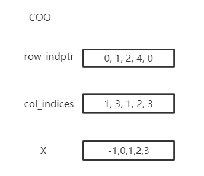

Introduction to Graphs
======================

Real-world graphs
-----------------
Graph-structured data have been widely utilized in many real-world scenarios. 
For example, each user on Facebook can be seen as a vertex and their relations like friendship or followership can be seen as edges in the graph. 
We might be interested in predicting the interests of users, or whether a pair of nodes in a network might have an edge connecting them.

A graph can be represented using an adjacency matrix

.. image:: ../_static/graph.png

.. image:: ../_static/adjacency_matrix.png

How to represent a graph in CogDL
---------------------------------
A graph is used to store information of structured data. CogDL represents a graph with a ``cogdl.data.Graph`` object.
Briefly, a ``Graph`` holds the following attributes:

- ``x``: Node feature matrix with shape ``[num_nodes, num_features]``, `torch.Tensor`
- ``edge_index``:  COO format sparse matrix, `Tuple`
- ``edge_weight``: Edge weight with shape ``[num_edges,]``, `torch.Tensor`
- ``edge_attr``: Edge attribute matrix with shape ``[num_edges, num_attr]``
- ``y``: Target labels of each node, with shape ``[num_nodes,]`` for single label case and `[num_nodes, num_labels]` for mult-label case
- ``row_indptr``: Row index pointer for CSR sparse matrix, `torch.Tensor`.
- ``col_indices``: Column indices for CSR sparse matrix, `torch.Tensor`.
- ``num_nodes``: The number of nodes in graph.
- ``num_edges``: The number of edges in graph.

The above are the basic attributes but are not necessary. You may define a graph with `g = Graph(edge_index=edges)` and omit the others.
Besides, ``Graph`` is not restricted to these attributes and other self-defined attributes, e.g., `graph.mask = mask`, are also supported.

Represent this graph in cogdl

.. image:: ../_static/coo.png

``Graph`` stores sparse matrix with COO or CSR format. COO format is easier to add or remove edges, e.x. `add_self_loops`, and CSR is stored for fast message-passing.
``Graph`` automatically convert between two formats and you can use both on demands without worrying. You can create a Graph with edges or assign edges
to a created graph. `edge_weight` will be automatically initialized as all ones, and you can modify it to fit your need.

.. code-block:: python

    import torch
    from cogdl.data import Graph
    edges = torch.tensor([[0,1],[1,3],[2,1],[4,2],[0,3]]).t()
    x = torch.tensor([[-1],[0],[1],[2],[3]])
    g = Graph(edge_index=edges,x=x) # equivalent to that above
    print(g.row_indptr)
    >>tensor([0, 2, 3, 4, 4, 5])
    print(g.col_indices)
    >>tensor([1, 3, 3, 1, 2])
    print(g.edge_weight)
    >> tensor([1., 1., 1., 1., 1.])
    g.num_nodes
    >> 5
    g.num_edges
    >> 5
    g.edge_weight = torch.rand(5)
    print(g.edge_weight)
    >> tensor([0.8399, 0.6341, 0.3028, 0.0602, 0.7190])

We also implement commonly used operations in ``Graph``:

- ``add_self_loops``: add self loops for nodes in graph,

.. math::

    \hat{A}=A+I

- ``add_remaining_self_loops``: add self-loops for nodes without it.
- ``sym_norm``: symmetric normalization of edge_weight used `GCN`:

.. math::

    \hat{A}=D^{-1/2}AD^{-1/2}

- ``row_norm``: row-wise normalization of edge_weight:

.. math::

    \hat{A} = D^{-1}A

- ``degrees``: get degrees for each node. For directed graph, this function returns in-degrees of each node.

.. code-block:: python

    import torch
    from cogdl.data import Graph
    edge_index = torch.tensor([[0,1],[1,3],[2,1],[4,2],[0,3]]).t()
    g = Graph(edge_index=edge_index)
    >> Graph(edge_index=[2, 5])
    g.add_remaining_self_loops()
    >> Graph(edge_index=[2, 10], edge_weight=[10])
    >> print(edge_weight) # tensor([1., 1., ..., 1.])
    g.row_norm()
    >> print(edge_weight) # tensor([0.3333, ..., 0.50])

- ``subgraph``: get a subgraph containing given nodes and edges between them.
- ``edge_subgraph``: get a subgraph containing given edges and corresponding nodes.
- ``sample_adj``: sample a fixed number of neighbors for each given node.

.. code-block:: python

    from cogdl.datasets import build_dataset_from_name
    g = build_dataset_from_name("cora")[0]
    g.num_nodes
    >> 2708
    g.num_edges
    >> 10556
    # Get a subgraph contaning nodes [0, .., 99]
    sub_g = g.subgraph(torch.arange(100))
    >> Graph(x=[100, 1433], edge_index=[2, 18], y=[100])
    # Sample 3 neighbors for each nodes in [0, .., 99]
    nodes, adj_g = g.sample_adj(torch.arange(100), size=3)
    >> Graph(edge_index=[2, 300]) # adj_g

- ``train/eval``: In inductive settings, some nodes and edges are unseen during training, ``train/eval`` provides access to switching backend graph for training/evaluation. In transductive setting, you may ignore this.

.. code-block:: python

    # train_step
    model.train()
    graph.train()

    # inference_step
    model.eval()
    graph.eval()

How to construct mini-batch graphs
----------------------------------

In node classification, all operations are in one single graph. But in tasks like graph classification, we need to deal with
many graphs with mini-batch. Datasets for graph classification contains graphs which can be accessed with index, e.x. ``data[2]``.
To support mini-batch training/inference, CogDL combines graphs in a batch into one whole graph, where adjacency matrices form sparse block diagnal matrices
and others(node features, labels) are concatenated in node dimension. ``cogdl.data.Dataloader`` handles the process.

.. code-block:: python

    from cogdl.data import DataLoader
    from cogdl.datasets import build_dataset_from_name

    dataset = build_dataset_from_name("mutag")
    >> MUTAGDataset(188)
    dataset[0]
    >> Graph(x=[17, 7], y=[1], edge_index=[2, 38])
    loader = DataLoader(dataset, batch_size=8)
    for batch in loader:
        model(batch)
    >> Batch(x=[154, 7], y=[8], batch=[154], edge_index=[2, 338])

``batch`` is an additional attributes that indicate the respective graph the node belongs to. It is mainly used to do global
pooling, or called `readout` to generate graph-level representation. Concretely, ``batch`` is a tensor like:

.. math::

    batch=[0,..,0, 1,...,1, N-1,...,N-1]

The following code snippet shows how to do global pooling to sum over features of nodes in each graph:

.. code-block:: python

    def batch_sum_pooling(x, batch):
        batch_size = int(torch.max(batch.cpu())) + 1
        res = torch.zeros(batch_size, x.size(1)).to(x.device)
        out = res.scatter_add_(
            dim=0,
            index=batch.unsqueeze(-1).expand_as(x),
            src=x
           )
        return out

How to edit the graph?
----------------------
Changes can be applied to edges in some settings. In such cases, we need to `generate` a graph for calculation while
keep the original graph. CogDL provides `graph.local_graph` to set up a local scape and any out-of-place operation will not
reflect to the original graph. However, in-place operation will affect the original graph.

.. code-block:: python

    graph = build_dataset_from_name("cora")[0]
    graph.num_edges
    >> 10556
    with graph.local_graph():
        mask = torch.arange(100)
        row, col = graph.edge_index
        graph.edge_index = (row[mask], col[mask])
        graph.num_edges
        >> 100
    graph.num_edges
    >> 10556

    graph.edge_weight
    >> tensor([1.,...,1.])
    with graph.local_graph():
        graph.edge_weight += 1
    graph.edge_weight
    >> tensor([2.,...,2.])

Common graph datasets
---------------------

Datasets of CogDL
=========================

CogDL now supports the following datasets for different tasks:

- Network Embedding (Unsupervised node classification): PPI, Blogcatalog, Wikipedia, Youtube, DBLP, Flickr
- Semi/Un-superviesd Node classification: Cora, Citeseer, Pubmed, Reddit, PPI, PPI-large, Yelp, Flickr, Amazon
- Heterogeneous node classification: DBLP, ACM, IMDB
- Link prediction: PPI, Wikipedia, Blogcatalog
- Multiplex link prediction: Amazon, YouTube, Twitter
- graph classification: MUTAG, IMDB-B, IMDB-M, PROTEINS, COLLAB, NCI, NCI109, Reddit-BINARY

Node classification
---------------------------------

CogDL provides a bunch of commonly used datasets for graph tasks like node classification, graph classification and others.
You can access them conveniently shown as follows.

=================== ============== =============== ============ =========== ======================= ========= ===============
     Dataset             Nodes         Edges          Features    Classes    Train/Val/Test         Degree     Name in cogdl
=================== ============== =============== ============ =========== ======================= ========= ===============
    Cora               2,708          5,429           1,433        7(s)        140 / 500 / 1000        2       cora
    Citeseer           3,327          4,732           3,703        6(s)        120 / 500 / 1000        1       citeseer
    PubMed             19,717         44,338          500          3(s)        60 / 500 / 1999         2       pubmed
    Chameleon          2,277          36,101          2,325        5           0.48 / 0.32 / 0.20      16      chameleon
    Cornell            183            298             1,703        5           0.48 / 0.32 / 0.20      1.6     cornell
    Film               7,600          30,019          932          5           0.48 / 0.32 / 0.20      4       film
    Squirrel           5201           217,073         2,089        5           0.48 / 0.32 / 0.20      41.7    squirrel
    Texas              182            325             1,703        5           0.48 / 0.32 / 0.20      1.8     texas
    Wisconsin          251            515             1,703        5           0.48 / 0.32 / 0.20      2       Wisconsin

    PPI                14,755         225,270         50           121(m)      0.66 / 0.12 / 0.22      15      ppi
    PPI-large          56,944         818,736         50           121(m)      0.79 / 0.11 / 0.10      14      ppi-large
    Reddit             232,965        11,606,919      602          41(s)       0.66 / 0.10 / 0.24      50      reddit
    Flickr             89,250         899,756         500          7(s)        0.50 / 0.25 / 0.25      10      flickr
    Yelp               716,847        6,977,410       300          100(m)      0.75 / 0.10 / 0.15      10      yelp
    Amazon-SAINT       1,598,960      132,169,734     200          107(m)      0.85 / 0.05 / 0.10      83      amazon-s
=================== ============== =============== ============ =========== ======================= ========= ===============

Network Embedding(Unsupervised Node classification)
------------------------------------------------------------------
============= ============ ============ =========== ========== =================
  Dataset        Nodes       Edges       Classes     Degree       Name in Cogdl
============= ============ ============ =========== ========== =================
  PPI            3,890        76,584       50(m)       20         ppi-ne
  BlogCatalog    10,312       333,983      40(m)       32         blogcatalog
  Wikipedia      4.777        184,812      39(m)       39         wikipedia
  Flickr         80,513       5,899,882    195(m)      73         flickr-ne
  DBLP           51,264       2,990,443    60(m)       2          dblp-ne
  Youtube        1,138,499    2,990,443    47(m)       3          youtube-ne
============= ============ ============ =========== ========== =================

Heterogenous Graph
------------------------------------------------------------------
=============== ========= ============ ============ =========== ================== ========== ============= ====================
Dataset         #Nodes    #Edges       #Features    #Classes    #Train/Val/Test    #Degree    #Edge Type    #Name in Cogdl
=============== ========= ============ ============ =========== ================== ========== ============= ====================
DBLP            18,405    67,946       334          4           800 / 400 / 2857   4          4             gtn-dblp(han-acm)
ACM             8,994     25,922       1,902        3           600 / 300 / 2125   3          4             gtn-acm(han-acm)
IMDB            12,772    37,288       1,256        3           300 / 300 / 2339   3          4             gtn-imdb(han-imdb)
Amazon-GATNE    10,166    148,863      -            -           -                  15         2             amazon
Youtube-GATNE   2,000     1,310,617    -            -           -                  655        5             youtube
Twitter         10,000    331,899      -            -           -                  33         4             twitter
=============== ========= ============ ============ =========== ================== ========== ============= ====================

Knowledge Graph Link Prediction
------------------------------------------------------------------
============ ========= ========= =========================== =================== ========== =================
Dataset      #Nodes    #Edges    #Train/Val/Test             #Relations Types    #Degree    #Name in Cogdl
============ ========= ========= =========================== =================== ========== =================
FB13         75,043    345,872   316,232 / 5,908 / 23,733    12                  5          fb13
FB15k        14,951    592,213   483,142 / 50,000 / 59,071   1345                40         fb15k
FB15k-237    14,541    310,116   272,115 / 17,535 / 20,466   237                 21         fb15k237
WN18         40,943    151,442   141,442 / 5,000 / 5,000     18                  4          wn18
WN18RR       86,835    93,003    86,835 / 3,034 / 3,134      11                  1          wn18rr
============ ========= ========= =========================== =================== ========== =================

Graph Classification
------------------------------------------------------------------

TUdataset from https://www.chrsmrrs.com/graphkerneldatasets

================== ========== =========== ============= ===================
Dataset            #Graphs    #Classes    #Avg. Size    #Name in Cogdl
================== ========== =========== ============= ===================
MUTAG              188        2           17.9          mutag
IMDB-B             1,000      2           19.8          imdb-b
IMDB-M             1,500      3           13            imdb-m
PROTEINS           1,113      2           39.1          proteins
COLLAB             5,000      5           508.5         collab
NCI1               4,110      2           29.8          nci1
NCI109             4,127      2           39.7          nci109
PTC-MR             344        2           14.3          ptc-mr
REDDIT-BINARY      2,000      2           429.7         reddit-b
REDDIT-MULTI-5k    4,999      5           508.5         reddit-multi-5k
REDDIT-MULTI-12k   11,929     11          391.5         reddit-multi-12k
BBBP               2,039      2           24            bbbp
BACE               1,513      2           34.1          bace
================== ========== =========== ============= ===================

.. code-block:: python

    from cogdl.datasets import build_dataset_from_name
    dataset = build_dataset_from_name("cora")
    
    from cogdl.datasets import build_dataset
    dataset = build_dataset(args) # if args.dataet = "cora"

For all datasets for node classification, we use `train_mask`, `val_mask`, `test_mask` to denote
train/validation/test split for nodes.
