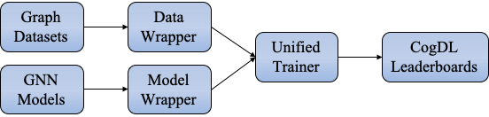

Model Training
==============
Customized  model training logic
--------------------------------
cogdl supports the selection of custom training logic, you can use the models and data sets in Cogdl to achieve your personalized needs.

.. code-block:: python

   import torch
   import torch.nn as nn
   import torch.nn.functional as F
   from cogdl import experiment
   from cogdl.datasets import build_dataset_from_name
   from cogdl.layers import GCNLayer
   from cogdl.models import BaseModel
   class Gnn(BaseModel):
       def __init__(self, in_feats, hidden_size, out_feats, dropout):
           super(Gnn, self).__init__()
           self.conv1 = GCNLayer(in_feats, hidden_size)
           self.conv2 = GCNLayer(hidden_size, out_feats)
           self.dropout = nn.Dropout(dropout)
       def forward(self, graph):
           graph.sym_norm()
           h = graph.x
           h = F.relu(self.conv1(graph, self.dropout(h)))
           h = self.conv2(graph, self.dropout(h))
           return F.log_softmax(h, dim=1)

   if __name__ == "__main__":
       dataset = build_dataset_from_name("cora")[0]
       model = Gnn(in_feats=dataset.num_features, hidden_size=64, out_feats=dataset.num_classes, dropout=0.1)
       optimizer = torch.optim.Adam(model.parameters(), lr=0.001, weight_decay=5e-3)
       model.train()
       for epoch in range(300):
           optimizer.zero_grad()
           out = model(dataset)
           loss = F.nll_loss(out[dataset.train_mask], dataset.y[dataset.train_mask])
           loss.backward()
           optimizer.step()
       model.eval()
       _, pred = model(dataset).max(dim=1)
       correct = float(pred[dataset.test_mask].eq(dataset.y[dataset.test_mask]).sum().item())
       acc = correct / dataset.test_mask.sum().item()
       print('The accuracy rate obtained by running the experiment with the custom training logic: {:.6f}'.format(acc))
       
Unified Trainer
---------------
CogDL provides a unified trainer for GNN models, which takes over the entire loop of the training process. The unified trainer, which contains much engineering code, is implemented flexibly to cover arbitrary GNN training settings. 

We design four decoupled modules for the GNN training, including *Model*, *Model Wrapper*, *Dataset*, *Data Wrapper*. The *Model Wrapper* is for the training and testing steps, while the *Data Wrapper* is designed to construct data loaders used by *Model Wrapper*. 

 
The main contributions of most GNN papers mainly lie on three modules except *Dataset*, as shown in the table. 
For example, the GCN paper trains the GCN model under the (semi-)supervised and full-graph setting, while the DGI paper trains the GCN model by maximizing local-global mutual information. 
The training method of the DGI is considered as a model wrapper named *dgi\_mw*, which could be used for other scenarios. 

============== ======== ================ ====================
Paper          Model    Model Wrapper    Data Wrapper       
============== ======== ================ ====================
GCN            GCN      supervised       full-graph          
GAT            GAT      supervised       full-graph          
GraphSAGE      SAGE     sage\_mw         neighbor sampling   
Cluster-GCN    GCN      supervised       graph clustering    
DGI            GCN      dgi\_mw          full-graph          
============== ======== ================ ====================

Based on the design of the unified trainer and decoupled modules, we could do arbitrary combinations of models, model wrappers, and data wrappers. For example, if we want to apply DGI to large-scale datasets, all we need is to substitute the full-graph data wrapper with the neighbor-sampling or clustering data wrappers without additional modifications. 
If we propose a new GNN model, all we need is to write essential PyTorch-style code for the model. The rest could be automatically handled by CogDL by specifying the model wrapper and the data wrapper. 
We could quickly conduct experiments for the model using the trainer via ``trainer = Trainer(epochs,...)`` and ``trainer.run(...)``.
Moreover, based on the unified trainer, CogDL provides native support for many useful features, including hyperparameter optimization, efficient training techniques, and experiment management without any modification to the model implementation. 

Experiment API
--------------
CogDL provides a more easy-to-use API upon *Trainer*, i.e., *experiment*. 
We take node classification as an example and show how to use CogDL to finish a workflow using GNN. In supervised setting, node classification aims to predict the ground truth label for each node. 
CogDL provides abundant of common benchmark datasets and GNN models. On the one hand, you can simply start a running using
models and datasets in CogDL. This is convenient when you want to test the reproducibility of proposed GNN or get baseline
results in different datasets.

.. code-block:: python

    from cogdl import experiment
    experiment(model="gcn", dataset="cora")

Or you can create each component separately and manually run the process using ``build_dataset``, ``build_model`` in CogDL.

.. code-block:: python

    from cogdl import experiment
    from cogdl.datasets import build_dataset
    from cogdl.models import build_model
    from cogdl.options import get_default_args 

    args = get_default_args(model="gcn", dataset="cora")
    dataset = build_dataset(args)
    model = build_model(args)
    experiment(model=model, dataset=dataset)

As show above, model/dataset are key components in establishing a training process. In fact, CogDL also supports
customized model and datasets. This will be introduced in next chapter. In the following we will briefly show the details
of each component.

How to save trained model?
--------------------------

CogDL supports saving the trained model with ``checkpoint_path`` in command line or API usage. For example:

.. code-block:: python

    experiment(model="gcn", dataset="cora", checkpoint_path="gcn_cora.pt")

When the training stops, the model will be saved in `gcn_cora.pt`. If you want to continue the training from previous checkpoint
with different parameters(such as learning rate, weight decay and etc.), keep the same model parameters (such as hidden size, model layers)
and do it as follows:

.. code-block:: python

    experiment(model="gcn", dataset="cora", checkpoint_path="gcn_cora.pt", resume_training=True)

In command line usage, the same results can be achieved with ``--checkpoint-path {path}`` and ``--resume-training``.

How to save embeddings?
-----------------------
Graph representation learning (network embedding and unsupervised GNNs) aims to get node representation. The embeddings
can be used in various downstream applications. CogDL will save node embeddings in the given path specified by ``--save-emb-path {path}``. 

.. code-block:: python

    experiment(model="prone", dataset="blogcatalog", save_emb_path="./embeddings/prone_blog.npy")

Evaluation on node classification will run as the end of training. We follow the same experimental settings used in DeepWalk, Node2Vec and ProNE.
We randomly sample different percentages of labeled nodes for training a liblinear classifier and use the remaining for testing
We repeat the training for several times and report the average Micro-F1. By default, CogDL samples 90% labeled nodes for training
for one time. You are expected to change the setting with ``--num-shuffle`` and ``--training-percents`` to your needs.

In addition, CogDL supports evaluating node embeddings without training in different evaluation settings. The following
code snippet evaluates the embedding we get above:

.. code-block:: python

    experiment(
        model="prone",
        dataset="blogcatalog",
        load_emb_path="./embeddings/prone_blog.npy",
        num_shuffle=5,
        training_percents=[0.1, 0.5, 0.9]
    )

You can also use command line to achieve the same results

.. code-block:: bash

    # Get embedding
    python script/train.py --model prone --dataset blogcatalog

    # Evaluate only
    python script/train.py --model prone --dataset blogcatalog --load-emb-path ./embeddings/prone_blog.npy --num-shuffle 5 --training-percents 0.1 0.5 0.9

