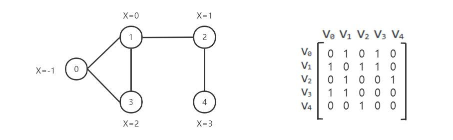
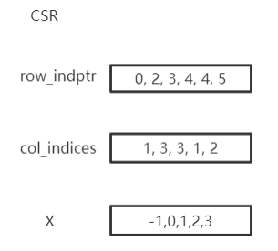
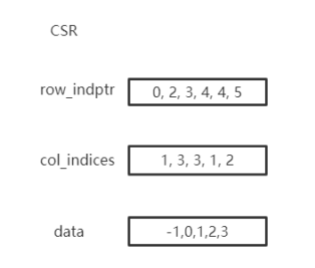

图简介
======================

真实世界的图表
-------------
图结构数据已在许多现实世界场景中得到广泛应用。例如，Facebook 上的每个用户都可以被视为一个顶点，而他们之间比如友谊或追随性等关系可以被视为图中的边。
我们可能对预测用户的兴趣或者对网络中的一对节点是否有有连接它们的边感兴趣。

我们可以使用邻接矩阵表示一张图

如何在 CogDL 中表示图形
--------------------
图用于存储结构化数据的信息,在CogDL中使用cogdl.data.Graph对象来表示一张图。简而言之，一个Graph具有以下属性：

- x: 节点特征矩阵，shape[num_nodes, num_features]，torch.Tensor
- edge_index：COO格式的稀疏矩阵，tuple
- edge_weight：边权重shape[num_edges,]，torch.Tensor
- edge_attr：边属性矩阵shape[num_edges, num_attr]
- y: 每个节点的目标标签,单标签情况下shape [num_nodes,],多标签情况下的shape [num_nodes, num_labels]
- row_indptr：CSR 稀疏矩阵的行索引指针，torch.Tensor。
- col_indices：CSR 稀疏矩阵的列索引，torch.Tensor。
- num_nodes：图中的节点数。
- num_edges：图中的边数。

以上是基本属性，但不是必需的。你可以用 g = Graph(edge_index=edges) 定义一个图并省略其他属性。此外，Graph不限于这些属性，还支持其他自定义属性，
例如graph.mask = mask。

在Cogdl中表示这张图

======== ========
|image2| |image3|
======== ========

Graph以 COO 或 CSR 格式存储稀疏矩阵。COO 格式更容易添加或删除边，例如 add_self_loops，使用CSR存储是为了用于快速消息传递。 Graph自动在两种格式之间转换，您可以按需使用两种格式而无需担心。您可以创建带有边的图形或将边分配给创建的图形。edge_weight 将自动初始化为1，您可以根据需要对其进行修改。

.. code-block:: python

    import torch
    from cogdl.data import Graph
    edges = torch.tensor([[0,1],[1,3],[2,1],[4,2],[0,3]]).t()
    x = torch.tensor([[-1],[0],[1],[2],[3]])
    g = Graph(edge_index=edges,x=x) # equivalent to that above
    print(g.row_indptr)
    >>tensor([0, 2, 3, 4, 4, 5])
    print(g.col_indices)
    >>tensor([1, 3, 3, 1, 2])
    print(g.edge_weight)
    >> tensor([1., 1., 1., 1., 1.])
    g.num_nodes
    >> 5
    g.num_edges
    >> 5
    g.edge_weight = torch.rand(5)
    print(g.edge_weight)
    >> tensor([0.8399, 0.6341, 0.3028, 0.0602, 0.7190])

我们在Graph中实现了常用的操作：

- ``add_self_loops``: 为图中的节点添加自循环

.. math::

    \hat{A}=A+I

- ``add_remaining_self_loops``: 为图中还没有自环的节点添加自环

- ``sym_norm``:使用 GCN 的 edge_weight 的对称归一化

.. math::

    \hat{A}=D^{-1/2}AD^{-1/2}

- ``row_norm``: edge_weight 的逐行归一化:

.. math::

    \hat{A} = D^{-1}A

- ``degrees``: 获取每个节点的度数。对于有向图，此函数返回每个节点的入度

.. code-block:: python

    import torch
    from cogdl.data import Graph
    edge_index = torch.tensor([[0,1],[1,3],[2,1],[4,2],[0,3]]).t()
    g = Graph(edge_index=edge_index)
    >> Graph(edge_index=[2, 5])
    g.add_remaining_self_loops()
    >> Graph(edge_index=[2, 10], edge_weight=[10])
    >> print(edge_weight) # tensor([1., 1., ..., 1.])
    g.row_norm()
    >> print(edge_weight) # tensor([0.3333, ..., 0.50])

- ``subgraph``: 得到一个包含给定节点和它们之间的边的子图。
- ``edge_subgraph``: 得到一个包含给定边和相应节点的子图。
- ``sample_adj``: 为每个给定节点采样固定数量的邻居

.. code-block:: python

    from cogdl.datasets import build_dataset_from_name
    g = build_dataset_from_name("cora")[0]
    g.num_nodes
    >> 2708
    g.num_edges
    >> 10556
    # Get a subgraph contaning nodes [0, .., 99]
    sub_g = g.subgraph(torch.arange(100))
    >> Graph(x=[100, 1433], edge_index=[2, 18], y=[100])
    # Sample 3 neighbors for each nodes in [0, .., 99]
    nodes, adj_g = g.sample_adj(torch.arange(100), size=3)
    >> Graph(edge_index=[2, 300]) # adj_g

- ``train/eval``:在inductive的设置中, 一些节点和边在trainning中看不见的, 对于training/evaluation使用 ``train/eval`` 来切换backend graph. 在transductive设置中,您可以忽略这一点.

.. code-block:: python

    # train_step
    model.train()
    graph.train()

    # inference_step
    model.eval()
    graph.eval()

如何构建mini-batch graphs
-------------------------

在节点分类中，所有操作都在一个图中。但是在像图分类这样的任务中，我们需要用 mini-batch 处理很多图。图分类的数据集包含可以使用索引访问的图，例如data
[2]。为了支持小批量训练/推理，CogDL 将一批中的图组合成一个完整的图，其中邻接矩阵形成稀疏块对角矩阵，其他的（节点特征、标签）在节点维度上连接。
这个过程由由cogdl.data.Dataloader来处理。

.. code-block:: python

    from cogdl.data import DataLoader
    from cogdl.datasets import build_dataset_from_name

    dataset = build_dataset_from_name("mutag")
    >> MUTAGDataset(188)
    dataset[0]
    >> Graph(x=[17, 7], y=[1], edge_index=[2, 38])
    loader = DataLoader(dataset, batch_size=8)
    for batch in loader:
        model(batch)
    >> Batch(x=[154, 7], y=[8], batch=[154], edge_index=[2, 338])

``batch`` 是一个附加属性，指示节点所属的各个图。它主要用于做全局池化，或者称为readout来生成graph-level表示。具体来说，batch是一个像这样的张量

.. math::

    batch=[0,..,0, 1,...,1, N-1,...,N-1]

以下代码片段显示了如何进行全局池化对每个图中节点的特征进行求和

.. code-block:: python

    def batch_sum_pooling(x, batch):
        batch_size = int(torch.max(batch.cpu())) + 1
        res = torch.zeros(batch_size, x.size(1)).to(x.device)
        out = res.scatter_add_(
            dim=0,
            index=batch.unsqueeze(-1).expand_as(x),
            src=x
           )
        return out

如何编辑一个graph?
----------------

在某些设置中，可以更改edges.在这种情况下，我们需要在保留原始图的同时生成计算图。CogDL 提供了 graph.local_graph 来设置local scape，任何out-of-place
操作都不会反映到原始图上。但是， in-place操作会影响原始图形。

.. code-block:: python

    graph = build_dataset_from_name("cora")[0]
    graph.num_edges
    >> 10556
    with graph.local_graph():
        mask = torch.arange(100)
        row, col = graph.edge_index
        graph.edge_index = (row[mask], col[mask])
        graph.num_edges
        >> 100
    graph.num_edges
    >> 10556

    graph.edge_weight
    >> tensor([1.,...,1.])
    with graph.local_graph():
        graph.edge_weight += 1
    graph.edge_weight
    >> tensor([2.,...,2.])

常见的graph数据集
---------------------

CogDL 为节点分类、图分类等任务提供了一些常用的数据集。您可以方便地访问它们，如下所示：

.. code-block:: python

    from cogdl.datasets import build_dataset_from_name
    dataset = build_dataset_from_name("cora")

    from cogdl.datasets import build_dataset
    dataset = build_dataset(args) # if args.dataet = "cora"

对于节点分类的所有数据集，我们使用 train_mask、val_mask、test_mask 来表示节点的训练/验证/测试拆分。

CogDL 现在支持以下的数据集用于不同的任务：

- Network Embedding (无监督节点分类): PPI, Blogcatalog, Wikipedia, Youtube, DBLP, Flickr
- 半监督/无监督节点分类: Cora, Citeseer, Pubmed, Reddit, PPI, PPI-large, Yelp, Flickr, Amazon
- 异构节点分类: DBLP, ACM, IMDB
- 链接预测: PPI, Wikipedia, Blogcatalog
- 多路链接预测: Amazon, YouTube, Twitter
- 图分类: MUTAG, IMDB-B, IMDB-M, PROTEINS, COLLAB, NCI, NCI109, Reddit-BINARY

Network Embedding(无监督节点分类)
___________________________________________________
============= ============ ============ =========== ========== =================
  Dataset        Nodes       Edges       Classes     Degree       Name in Cogdl
============= ============ ============ =========== ========== =================
  PPI            3,890        76,584       50(m)       —          ppi-ne
  BlogCatalog    10,312       333,983      40(m)       32         blogcatalog
  Wikipedia      4.777        184,812      39(m)       39         wikipedia
  Flickr         80,513       5,899,882    195(m)      73         flickr-ne
  DBLP           51,264       2,990,443    60(m)       2          dblp-ne
  Youtube        1,138,499    2,990,443    47(m)       3          youtube-ne
============= ============ ============ =========== ========== =================

节点分类
________

=================== ============== =============== ============ =========== ======================= ========= ===============
     Dataset             Nodes         Edges          Features    Classes    Train/Val/Test         Degree     Name in cogdl
=================== ============== =============== ============ =========== ======================= ========= ===============
    Cora               2,708          5,429           1,433        7(s)        140 / 500 / 1000        2       cora
    Citeseer           3,327          4,732           3,703        6(s)        120 / 500 / 1000        1       citeseer
    PubMed             19,717         44,338          500          3(s)        60 / 500 / 1999         2       pubmed
    Chameleon          2,277          36,101          2,325        5           0.48 / 0.32 / 0.20      16      chameleon
    Cornell            183            298             1,703        5           0.48 / 0.32 / 0.20      1.6     cornell
    Film               7,600          30,019          932          5           0.48 / 0.32 / 0.20      4       film
    Squirrel           5201           217,073         2,089        5           0.48 / 0.32 / 0.20      41.7    squirrel
    Texas              182            325             1,703        5           0.48 / 0.32 / 0.20      1.8     texas
    Wisconsin          251            515             1,703        5           0.48 / 0.32 / 0.20      2       Wisconsin

    PPI                14,755         225,270         50           121(m)      0.66 / 0.12 / 0.22      15      ppi
    PPI-large          56,944         818,736         50           121(m)      0.79 / 0.11 / 0.10      14      ppi-large
    Reddit             232,965        11,606,919      602          41(s)       0.66 / 0.10 / 0.24      50      reddit
    Flickr             89,250         899,756         500          7(s)        0.50 / 0.25 / 0.25      10      flickr
    Yelp               716,847        6,977,410       300          100(m)      0.75 / 0.10 / 0.15      10      yelp
    Amazon-SAINT       1,598,960      132,169,734     200          107(m)      0.85 / 0.05 / 0.10      83      amazon-s
=================== ============== =============== ============ =========== ======================= ========= ===============

异构图
__________________
=============== ========= ============ ============ =========== ================== ========== ============= ====================
Dataset          Nodes     Edges        Features     Classes     Train/Val/Test     Degree     Edge Type     Name in Cogdl
=============== ========= ============ ============ =========== ================== ========== ============= ====================
DBLP            18,405    67,946       334          4           800 / 400 / 2857   4          4             gtn-dblp(han-acm)
ACM             8,994     25,922       1,902        3           600 / 300 / 2125   3          4             gtn-acm(han-acm)
IMDB            12,772    37,288       1,256        3           300 / 300 / 2339   3          4             gtn-imdb(han-imdb)
Amazon-GATNE    10,166    148,863       —           —                  —           15         2             amazon
Youtube-GATNE   2,000     1,310,617     —           —                  —           655        5             youtube
Twitter         10,000    331,899       —           —                  —           33         4             twitter
=============== ========= ============ ============ =========== ================== ========== ============= ====================

知识图谱链接预测
________________________________
============ ========= ========= =========================== =================== ========== =================
Dataset       Nodes     Edges     Train/Val/Test              Relations Types     Degree     Name in Cogdl
============ ========= ========= =========================== =================== ========== =================
FB13         75,043    345,872   316,232 / 5,908 / 23,733    12                  5          fb13
FB15k        14,951    592,213   483,142 / 50,000 / 59,071   1345                40         fb15k
FB15k-237    14,541    310,116   272,115 / 17,535 / 20,466   237                 21         fb15k237
WN18         40,943    151,442   141,442 / 5,000 / 5,000     18                  4          wn18
WN18RR       86,835    93,003    86,835 / 3,034 / 3,134      11                  1          wn18rr
============ ========= ========= =========================== =================== ========== =================

图分类
_____________________

TUdataset from https://www.chrsmrrs.com/graphkerneldatasets

================== ========== =========== ============= ===================
Dataset             Graphs     Classes     Avg. Size     Name in Cogdl
================== ========== =========== ============= ===================
MUTAG              188        2           17.9          mutag
IMDB-B             1,000      2           19.8          imdb-b
IMDB-M             1,500      3           13            imdb-m
PROTEINS           1,113      2           39.1          proteins
COLLAB             5,000      5           508.5         collab
NCI1               4,110      2           29.8          nci1
NCI109             4,127      2           39.7          nci109
PTC-MR             344        2           14.3          ptc-mr
REDDIT-BINARY      2,000      2           429.7         reddit-b
REDDIT-MULTI-5k    4,999      5           508.5         reddit-multi-5k
REDDIT-MULTI-12k   11,929     11          391.5         reddit-multi-12k
BBBP               2,039      2           24            bbbp
BACE               1,513      2           34.1          bace
================== ========== =========== ============= ===================

