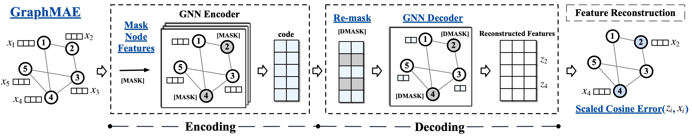
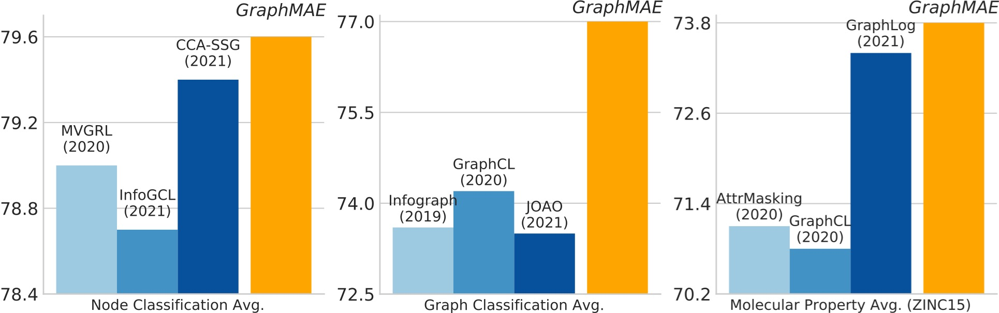
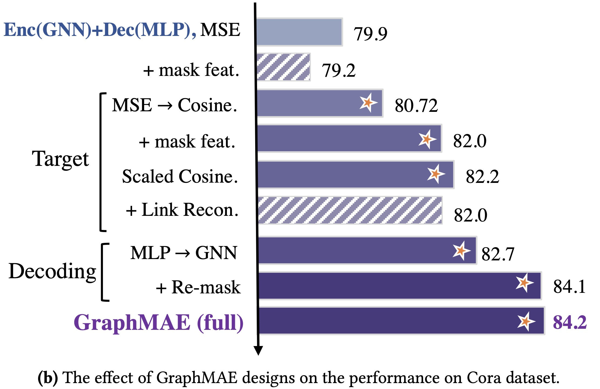

<p>
  
  <br />
</p>

<hr>

<h1> GraphMAE: Self-Supervised Masked Graph Autoencoders </h1>

CogDL implementation for KDD'22 paper:  [GraphMAE: Self-Supervised Masked Graph Autoencoders](https://arxiv.org/abs/2205.10803).

We also have a [Chinese blog](https://zhuanlan.zhihu.com/p/520389049) about GraphMAE on Zhihu (知乎), and an [English Blog](https://medium.com/p/7a641f8c66d0#4fae-bff62a5b8b4b) on Medium.

GraphMAE is a generative self-supervised graph learning method, which achieves competitive or better performance than existing contrastive methods on tasks including *node classification*, *graph classification*, and *molecular property prediction*.

<p>
  
  <br />
</p>
<h2>Dependencies </h2>

* Python >= 3.7
* [Pytorch](https://pytorch.org/) >= 1.9.0 
* [cogdl](https://github.com/THUDM/cogdl) >= 0.5.3
* pyyaml == 5.4.1

<h2>Quick Start </h2>

For quick start, you could run the scripts: 

**Node classification**

```bash
sh scripts/run_transductive.sh <dataset_name> <gpu_id> # for transductive node classification
# example: sh scripts/run_transductive.sh cora/citeseer/pubmed/ogbn-arxiv 0
sh scripts/run_inductive.sh <dataset_name> <gpu_id> # for inductive node classification
# example: sh scripts/run_inductive.sh reddit/ppi 0

# Or you could run the code manually:
# for transductive node classification
python main_transductive.py --dataset cora --encoder gat --decoder gat --seed 0 --device 0
# for inductive node classification
python main_inductive.py --dataset ppi --encoder gat --decoder gat --seed 0 --device 0
```

Supported datasets:

* transductive node classification:  `cora`, `citeseer`, `pubmed`, `ogbn-arxiv`
* inductive node classification: `ppi`, `reddit` 

Run the scripts provided or add `--use_cfg` in command to reproduce the reported results.


**Graph classification**

```bash
sh scripts/run_graph.sh <dataset_name> <gpu_id>
# example: sh scripts/run_graph.sh mutag/imdb-b/imdb-m/proteins/... 0 

# Or you could run the code manually:
python main_graph.py --dataset IMDB-BINARY --encoder gin --decoder gin --seed 0 --device 0
```

Supported datasets: 

- `IMDB-BINARY`, `IMDB-MULTI`, `PROTEINS`, `MUTAG`, `NCI1`, `REDDIT-BINERY`, `COLLAB`

Run the scripts provided or add `--use_cfg` in command to reproduce the reported results.


<h1> Citing </h1>

If you find this work is helpful to your research, please consider citing our paper:

```
@inproceedings{hou2022graphmae,
  title={GraphMAE: Self-Supervised Masked Graph Autoencoders},
  author={Hou, Zhenyu and Liu, Xiao and Cen, Yukuo and Dong, Yuxiao and Yang, Hongxia and Wang, Chunjie and Tang, Jie},
  booktitle={Proceedings of the 28th ACM SIGKDD Conference on Knowledge Discovery and Data Mining},
  pages={594--604},
  year={2022}
}
```
