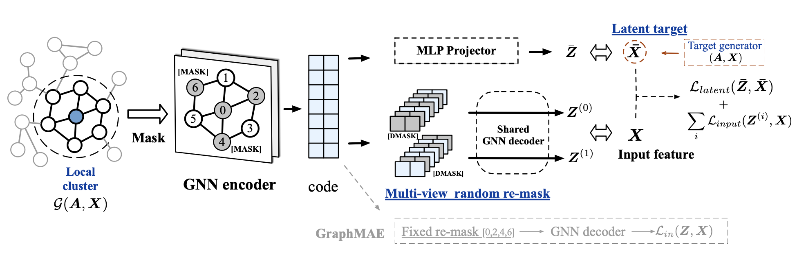

<h1> GraphMAE2: A Decoding-Enhanced Masked Self-Supervised
Graph Learner </h1>

[**CogDL**](https://github.com/THUDM/cogdl) Implementation for WWW'23 paper:  [GraphMAE2: A Decoding-Enhanced Masked Self-Supervised
Graph Learner](https://arxiv.org/abs/2304.04779).


[GraphMAE] The predecessor of this work: [GraphMAE: Self-Supervised Masked Graph Autoencoders](https://arxiv.org/abs/2205.10803) can be found [here](https://github.com/THUDM/cogdl/tree/master/examples/graphmae).

<h2>Dependencies </h2>

* Python >= 3.7
* [Pytorch](https://pytorch.org/) >= 1.9.0 
* [cogdl](https://github.com/THUDM/cogdl) >= 0.5.3
* pyyaml == 5.4.1


<h2>Quick Start </h2>

For quick start, you could run the scripts: 

**Node classification**

```bash
sh run_minibatch.sh <dataset_name> <gpu_id> # for mini batch node classification
# example: sh run_minibatch.sh ogbn-arxiv 0
sh run_fullbatch.sh <dataset_name> <gpu_id> # for full batch node classification
# example: sh run_fullbatch.sh cora 0

# Or you could run the code manually:
# for mini batch node classification
python main_large.py --dataset ogbn-arxiv --encoder gat --decoder gat --seed 0 --device 0
# for full batch node classification
python main_full_batch.py --dataset cora --encoder gat --decoder gat --seed 0 --device 0
```

Supported datasets:

* mini batch node classification:  `ogbn-arxiv`, `ogbn-products`, `mag-scholar-f`, `ogbn-papers100M`
* full batch node classification: `cora`, `citeseer`, `pubmed`

Run the scripts provided or add `--use_cfg` in command to reproduce the reported results.

**For Large scale graphs**
Before starting mini-batch training, you'll need to generate local clusters if you want to use local-clustering for training. By default, the program will load dataset from `./data` and save the generated local clusters to `./lc_ego_graphs`. To generate a local cluster,  you should first install [localclustering](https://github.com/kfoynt/LocalGraphClustering) and then run the following command:

```
python ./datasets/localclustering.py --dataset <your_dataset> --data_dir <path_to_data>
```
And we also provide the pre-generated local clusters which can be downloaded [here](https://cloud.tsinghua.edu.cn/d/64f859f389ca43eda472/) and then put into `lc_ego_graphs` for usage.


<h2> Datasets </h2>

During the code's execution, the OGB and small-scale datasets (Cora, Citeseer, and PubMed) will be downloaded automatically. 

<h2> Experimental Results </h2>

Experimental results of node classification on large-scale datasets (Accuracy, %):

|                    | Ogbn-arxiv         | Ogbn-products     | Mag-Scholar-F       | Ogbn-papers100M     | 
| ------------------ | ------------ | ------------ | ------------ | -------------- |
| MLP                | 55.50±0.23     | 61.06±0.08     | 39.11±0.21     | 47.24±0.31     | 
| SGC              | 66.92±0.08     | 74.87±0.25     | 54.68±0.23     | 63.29±0.19        | 
| Random-Init               | 68.14±0.02     | 74.04±0.06     | 56.57±0.03     | 61.55±0.12     | 
| CCA-SSG            | 68.57±0.02     | 75.27±0.05     | 51.55±0.03     | 55.67±0.15     | 
| GRACE            | 69.34±0.01     | 79.47±0.59     | 57.39±0.02     | 61.21±0.12     | 
| BGRL            | 70.51±0.03     | 78.59±0.02     | 57.57±0.01     | 62.18±0.15     | 
| GGD            | -     | 75.70±0.40     | -     | 63.50±0.50     | 
| GraphMAE            | 71.03±0.02     | 78.89±0.01     | 58.75±0.03     | 62.54±0.09     | 
| **GraphMAE2** | **71.89±0.03** | **81.59±0.02** | **59.24±0.01** | **64.89±0.04** |


<h1> Citing </h1>

If you find this work is helpful to your research, please consider citing our paper:

```
@inproceedings{hou2023graphmae2,
  title={GraphMAE2: A Decoding-Enhanced Masked Self-Supervised Graph Learner},
  author={Zhenyu Hou, Yufei He, Yukuo Cen, Xiao Liu, Yuxiao Dong, Evgeny Kharlamov, Jie Tang},
  booktitle={Proceedings of the ACM Web Conference 2023 (WWW’23)},
  year={2023}
}
```
